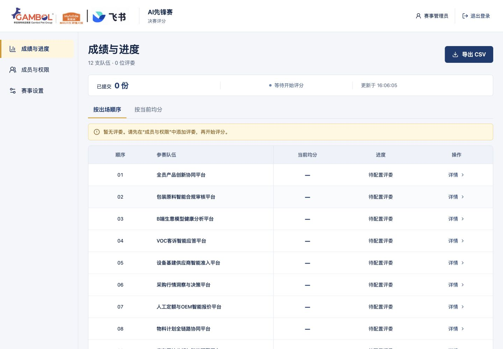
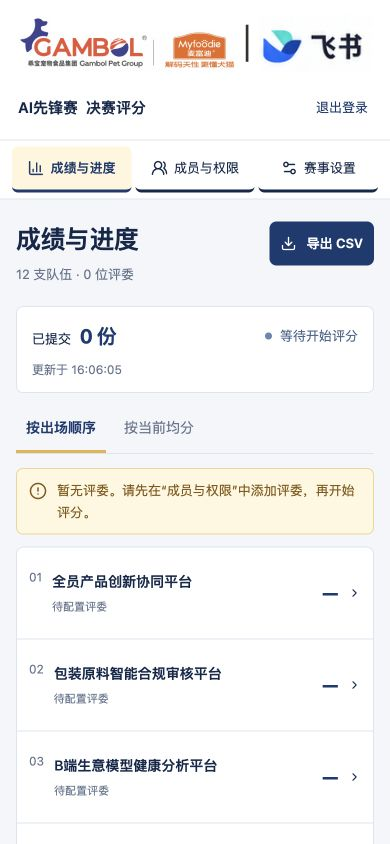

# 本地验证记录

验证日期：2026-09-18。所有提交和改分使用隔离演示库或自动创建的临时数据库，未产生正式比赛成绩。源码与说明位于当前项目，初赛参考文件未修改。

## 环境与结果

- macOS 27.0 / Apple M5 / arm64；Node 26.6.0；SQLite 3.53.4、WAL、FULL 同步。
- Chrome 153.0.8010.48：通过 CUA 的浏览器接口控制真实页面；Safari 27.0：通过 CUA 原生界面操作真实浏览器。没有用截图或静态页面冒充交互。
- 本地 URL：`http://127.0.0.1:3001`。API 与前端同源。
- `npm run build`：TypeScript、Vite 和服务端编译通过。
- `npm test`：5 组测试通过，0 失败；约 3.28 秒。覆盖业务规则、权限、持久化、HTTP 并发、备份恢复 CLI。
- 容量：磁盘 SQLite 临时数据库，50 个评委会话并行，各顺序提交 12 队，共 600 次 HTTP 评分写入；约 253 毫秒，无丢失、无重复。每队 50 条记录，均分核验 4.48；双设备同版本提交一份成功、一份 409。该耗时包含紧随其后的竞争检查，不包括账号初始化；是本机接口测试，不等同于 50 台终端或比赛网络压测。

## 验收检查

| 检查 | 结果与证据 |
| --- | --- |
| 来源一致 | 队伍 rev111、手册 rev232；12 个队名和顺序、44 条成员姓名与部门、12 个照片 token 与本地 PNG，全部对照原文；详细分档和提示也匹配。成熟度表的阶段与辅助说明以分号合并。见 `verification/source-check.json` |
| 页面身份与非空 | `/score`、`/admin/results`、`/admin/users`、`/admin/settings` 均显示对应内容，页面标题“AI先锋赛 · 决赛评分” |
| 框架错误与控制台 | 正常流程无错误覆盖层，Chrome 正常加载和后台检查 error/warn 为空；断网测试造成的请求失败属于主动注入场景 |
| 分数控件 | 滑块与数字同步；End 后左方向键得到 9.5；8.3 禁止提交；新队伍未预选；0、0.5、10 均通过规则验证 |
| 保存与切换 | Chrome 提交 0 分后进度从 2/12 到 3/12，自动进入第 4 队；旧队显示 0.0。Safari 提交 0.5 后进度到 4/12，自动进入第 5 队 |
| 断网与刷新 | Chrome 模拟断网后可继续填写 0.5 草稿，提交禁用并显示断网提示；恢复网络后主动提交。刷新保留分数与评语 |
| 超时与响应丢失 | 在真实浏览器拦截已成功写入的 201 响应，超过 15 秒后显示请求未完成并保留草稿；重试沿用同一 UUID，服务器再次返回 201，数据库仍为版本 1、17 个半分单位、仅一条评分审计。回查发现服务器已有记录时，提供“使用最新记录”核对恢复；另一次主动丢弃响应后也恢复成功，旧网络错误提示已清除。历史截图留存在本机归档 |
| 改分留痕 | 浏览器将第 3 队 0 改为 8.5，确认弹窗展示前后分数；后台看到版本 2、0.0 → 8.5 和两次提交时间 |
| 均分与排名 | 自动测试覆盖零分、未评、改分、等权均分、同分并列；排序使用整数交叉乘积比较，不先舍入 |
| 权限 | 评委直接打开后台显示“没有访问权限”；API 返回 403；未登录 401；管理员不能评分、缺 CSRF 被拒绝；用户 ID 取自会话，不接受代评参数 |
| 成员与名单 | 最后一位可用管理员不能移除；停用撤销会话；开赛固定名单，新账号不自动加入；权限变更后保留原分数 |
| 截止与重开 | 浏览器关闭演示赛事后显示锁定；Safari 刷新后输入与提交禁用。重新开放需原因，操作日志记录 open → closed → open 及原因。HTTP 测试覆盖截止与提交竞争：若写入先发生，审计必须早于关闭；否则拒绝且无写入 |
| 数据持久化 | 数据库重开后成绩保持；完整性检查 ok；一致性备份可读取；恢复 CLI 拒绝运行中的服务、恢复前保存旧库、恢复后清除会话 |
| 导出 | 队伍汇总与逐位评委明细基于同一结果函数；零分保留，未评分为空；CSV UTF-8 BOM、引号和公式注入转义经测试 |
| 响应式 | Chrome 360/390/430/1280/1440 CSS px：评委端与管理员端文档宽度均不超过视口；手机队伍抽屉、折叠标准、固定提交栏可用；桌面提交栏吸底。控件高至少 44px |
| 照片与标准 | 实际打开 VOC 队伍成员弹窗，真实照片、姓名和部门正常显示；六项标准按钮可打开详细分档 |

Safari 后台标签可能延迟定时器。页面现在在恢复可见、窗口聚焦或网络恢复时主动刷新，服务端的截止检查始终独立于页面显示，不依赖浏览器倒计时。

## 效果图对照

已分别打开 `docs/design/` 的三张生成参考和实际截图检查，主要对应如下：

| 对照点 | 实现与必要差异 |
| --- | --- |
| 主体布局 | 桌面左队列右评分；手机单栏和队伍弹窗；管理端侧导航与矩阵保留 |
| 品牌与色彩 | 白色为主，深蓝按钮与文字、姜黄滑块和选中标识；使用用户原始组合 logo，未沿用生成图片中的重绘 logo |
| 核心评分控件 | 完整替换按钮阵列为滑块＋数字框；醒目显示当前分数；初始空白，评分前没有默认值 |
| 阅读层次 | 队名最大，评分次之；六项标准在桌面展开、手机初次进入默认折叠；提示采用实际手册文字 |
| 状态与动作 | 底部提交区保留；增加草稿、联网、冲突与已提交的真实状态，替代效果图中的静态演示文案 |
| 成绩呈现 | 后台白色表格、醒目均分、姜黄未收齐提示；为保证触控与可读性，表格行高较效果图更大，12 队可滚动查看 |
| 手机内容高度 | 可滚动查看评语与完整说明，底部预留空间避免提交栏遮挡；不为塞入一屏缩小文字 |

## 复现方式与边界

关键命令：`npm run build`、`npm test`。浏览器路径：登录 → 滑块/数字输入 → 刷新 → 提交 → 自动下一队 → 回看改分 → 管理员明细与审计；以及断网、后台拒绝、结束和重新开放。

这是本地完成的验证。尚未验证真实 iPhone Safari/飞书内嵌浏览器、实际比赛 Wi-Fi、生产代理与飞书 OAuth。Chrome 手机视口验证不冒充真机验收；Safari 已完成桌面真实交互。后续部署前应使用最终环境和实际设备复测。

初版交互验收的截图保存在本机归档，现行网站截图如下：

## 移除演示模式后的复核

- 移除演示环境变量、会话字段、页头标识及初始化脚本；不提供示例账号或预置评分。
- 当前本地使用独立正式库，12 队、0 位评委、0 份评分、赛事未开始，仅初始化一名赛事管理员。
- 无评委时明确显示“待配置评委”，不将 0/0 误标为“已收齐”。
- 运行数据、随机初始密码、旧库恢复点与历史截图均不上传仓库。

本次移除演示模式后重新运行 `npm run build` 与 `npm test`：5 组通过、0 失败；600 次磁盘库 HTTP 提交约 269 毫秒。Chrome 1440×1000 与 390×844 复核正式管理员登录、12 队空成绩、待配置评委，控制台无相关 error/warn。
